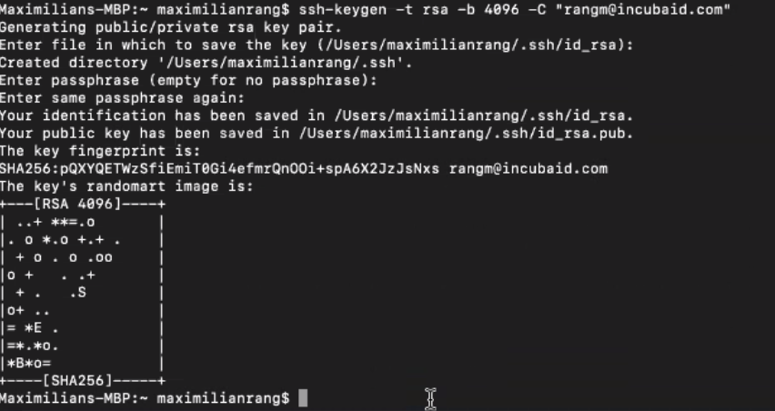

# tools to run ThreeFold web env

starting point to run all websites on your local machine

- blog
- wiki's
- websites

## get started
 - install tfweb
```
/bin/bash -c "$(curl -fsSL https://raw.githubusercontent.com/threefoldfoundation/websites/master/tools/install.sh)"
```
 - start tfweb 
 ```
cd ~/code/github/crystaluniverse/publishingtools;tfweb -c ~/code/github/threefoldfoundation/websites/config.toml

```
- important to start in publishingtools dir otherwise it will not start the blog
- best to have your sshkey loaded see
    - https://docs.github.com/en/github/authenticating-to-github/generating-a-new-ssh-key-and-adding-it-to-the-ssh-agent
    - https://docs.github.com/en/github/authenticating-to-github/adding-a-new-ssh-key-to-your-github-account
- note: make sure you are in your terminal and have your prompt, don't type the $ sign at front of the commands, this is part of your prompt



to manually add your ssh to the agent

```
ssh-add ~/.ssh/id_rsa
```

to see if it succeeded

```
ssh-add -l
2048 SHA256:olDf62/m6YOwIxYWUzrB6/XE4J4CalsxnaMpPuIEQpk /Users/despiegk/.ssh/id_rsa (RSA)
```

## developers

### to build

```
/bin/bash -c "$(curl -fsSL https://raw.githubusercontent.com/threefoldfoundation/websites/master/tools/build.sh)"
```

## information about tools inside

- https://github.com/crystaluniverse/publishingtools (is the tfweb, our webserver which can host wiki's, websites, blogs, ...)
   - unfortunately no manual, needs to be created
- https://github.com/crystaluniverse/crystaltools
   - there is a manual inside
   
when starting tfweb, it will also start the manuals for publishingtools & crystaltools

## troubeshooting

### OSX

- once brew installed do

```
brew update
brew upgrade
```

and try again, see if brew worked well


